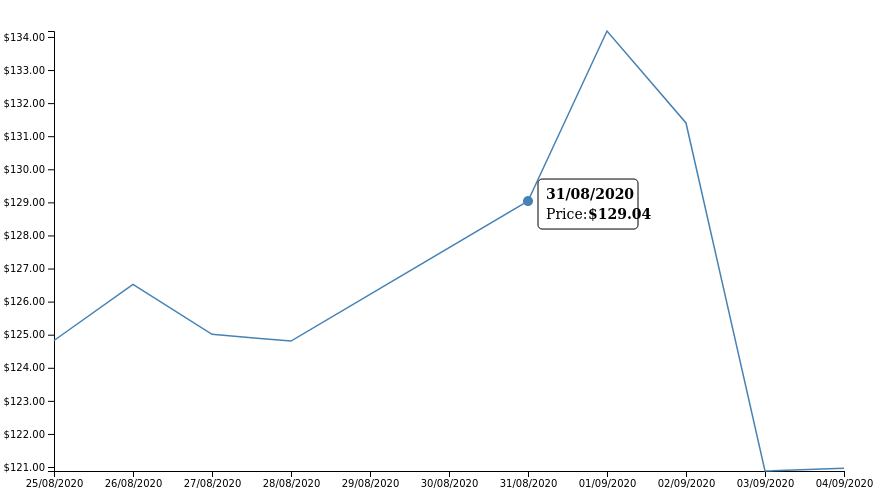

# d3js-chart
A Simple Chart with d3js



## start webserver via docker
```shell
docker run -d \
    --name=nginx \
    -p 80:80 \
    nginx:alpine
```

## start with mounted html dir
```shell
docker run -d \
    --name=nginx \
    -v $(pwd)/html:/usr/share/nginx/html \
    -p 80:80 \
    nginx:alpine
```

